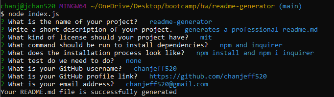

# readme-generator 



  ## Technology Used
  
  <ul>
      <li> JavaScript:  We used built in method like FileSystem to save data to an MarkDown page. </li>
      <li> Node.js: To run JavaScript without the browser </li>
      <li> npm: install packages like inquirer with the command line </li>
      <li> inquirer: better interaction with the terminal with inputs and storging data</li>
      <li> Git: for version control system to track changes to source code</li>
      <li> GitHub: hosts the repository </li>
  </ul>


  ## Description 

  Generates an professional README.md base on a questionnaire given to the user.


  ## Table of Contents

  1.  [Usage](#usage)

  2.  [Installations](#installation)

  3.  [License](#license)

  4.  [Author Links](#author)

  5.  [Contributors](#collab)

  6.  [Code Snippet](#code)


  ## installation <a id="installation"></a>

  Dependencies needed: npm, inquirer, node.js
  Installation : npm install and npm i inquirer


  ## Usage <a id="usage"></a>
  
  - Install the necessary dependencies from the installation section.
  - From the same directory as the 'index.js', enter node.js in the terminal
  - Fill out the questionnaire
  - The new README.md will be generated to 'generate-README.md'


  ## License  <a id="license"></a>

  


  ## Contributors <a id="collab"></a>

    none

  ## Code Snippet <a id="code"></a>

```js
// This function write to a exist or newfile with the information needed
function writeToFile(fileName, data) {
    fs.writeFile(fileName,data, err => {
        if(err){
            return console.log(err)
        }
        console.log("Your README.md file is successfully generated")
    })
}

// TODO: get inquirer to promp the questions, then overwrites a new file or an exist file of 'generate-README.md'
function init() {
    inquirer.prompt(questions)
        .then((answers) => {
            //This is an object with questions and answers
            const readmeContent = generateMarkdown(answers)
            //function to write information to a file
            writeToFile('generate-README.md', readmeContent);
        })
}

```


  ## Author Links <a id="author"></a>

  You can reach me on
  GitHub: [__chanjeff520__](https://github.com/chanjeff520)

  Email:  __chanjeff520@gmail.com__
